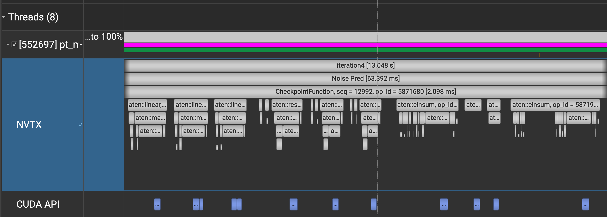
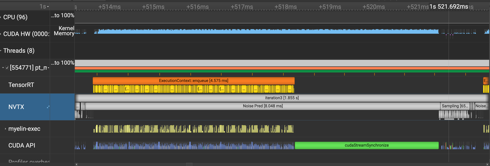
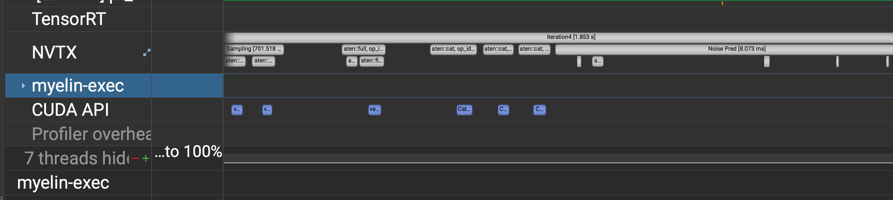
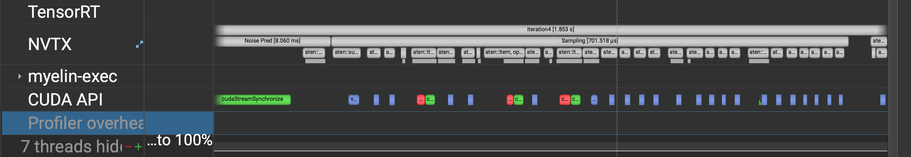
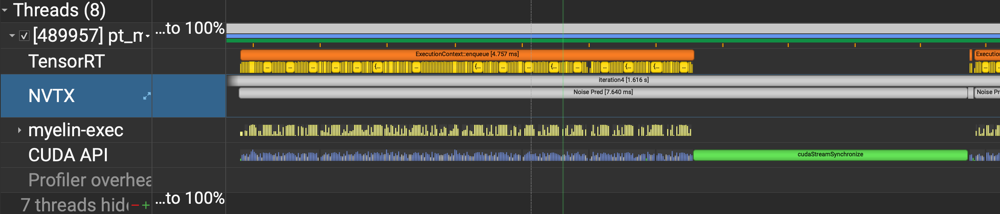
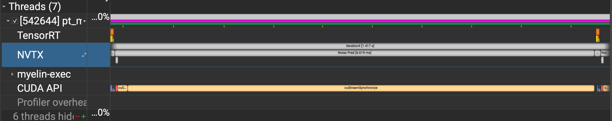
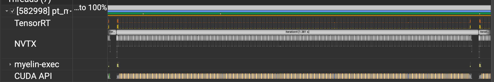

# Optimizing a Latent Diffusion Model
This project uses NVIDIA TensorRT to optimize original Latent Diffusion Model as a test to see how well out-of-box NVIDIA tookits can optimize the model performance without any quantization, step distilation or other model optimization techniques.

## Initial start point, Pytorch Model
Original Pytorch text-2-image generation with DDIM 200steps mean latency is 10.29s on a test A100 GPU with enough warm up. If we turn on the NVTX emission for torch profiler, we can see that many operations are not fused, for example the qkv computation in `CrossAttention` module is separated to three linear ops but we can combine them to better use GPU for acceleration. We can also see that the multi-head attention is also separated to many individual operations.

## TensorRT FP32 & FP16
By simply building the original UNet model as an TensorRT engine, we can get many operation fused through all the out-of-box optimization strategies provided by TensorRT. With UNet TensorRT engine in FP32 the original text-to-image generation mean latency reduced to 2.89s while FP16 engine can bring the latency further down to 1.86s. This is an immediate 5x speedup without too much work done here other than exporting the Pytorch model to onnx and build a TRT engine from the model onnx file!

Taking a closer look into the kernels being called during TRT execution, we can find that 
* Three QKV linear transform are combined to one GEMM kernel call
* Multi-head attention operations are fused to one GEMM MHA kernel call
* Many transpose, reshape, point-wise operations are fused to one kernel to speedup.

## Pipeline optimization
Even though the UNet is exported as TensorRT engine, we're still calling Pytorch operations for pre-processing and sampling with predicted noise, which bring us a fragmented call to CUDA kernels and taking 10% of the denoising latency. To improve efficiency, we can fuse the entire $x_{t-1}$ sampling to one point-wise operation, then move each denoising step's pre-processing concat after sampling to directly generate result ready for next step's denoising.

Also, the model is computing KV value for the context in each denoising step which is redundant, what we can do is separate the SpatialTransformer block to context KV cache generation network and UNet with context KV caches. However, the overhead for context KV computation is not very large, doing this can only reduce about 0.1ms in each denoising step.

After pipeline optimization, the denoising step becomes a very clean two TensorRT executions, bringing the total latency to 1.61s.

## CUDA Graph
Another optimization we can do is utilize CUDA graph to reduce the overhead of launching CUDA kernels in denoising step. However, since we cannot change the tensor address once the execution graph is captured, we'll need to pay the small price of copying the timestep tensor to a fixed location everytime it changed before launching the CUDA Graph. With CUDA graph, we can achieve 1.41s mean latency for the image generation.

## Build TensorRT engine for BERT and First Stage Decoder.
We can also build TRT engine for BERT embedder and first stage decoder, bring the total latency of 200 steps image generation to 1.38s.

Here're some images generated from the optimized models, cheers
  